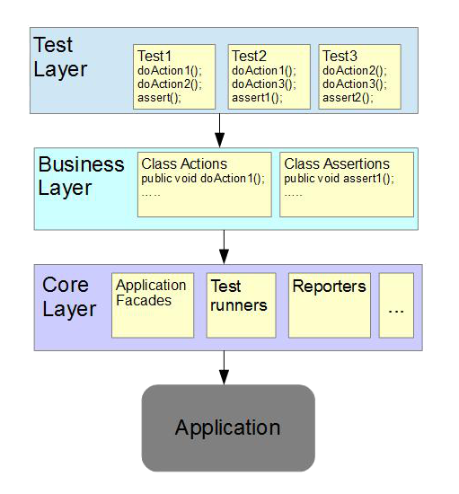

## Test automation framework architecture: Layered architecture

In addition to this page you may also have a look at the implementation example:
[http://aqaguy.blogspot.com.by/2018/02/test-automation-framework-architecture.html](http://aqaguy.blogspot.com.by/2018/02/test-automation-framework-architecture.html)

Probably the most popular architecture pattern used for test automation frameworks (TAF) is layered architecture. This pattern is so well known that on job interviews for some companies when they ask you about TAF architecture you are supposed to describe this one. If you don't - they think you know nothing about the architecture altogether.

I suggest first reading brilliant description of the pattern at the [O.REILLY  web page](https://www.oreilly.com/library/view/software-architecture-patterns/9781491971437/ch01.html), cause in this post I am going to describe the pattern in a way it is usually applied to build test automation solution.

Usually, there're three distinct layers, which may have different names, but follow the same logic mostly. Sometimes those layers called *test layer*, *business-layer* and *core layer* , but there're no standard names really. Key rules for layered architecture are the dependency direction (each level depend on the level below) and call direction (no level can call/reference code described in the level above).

The rough structure of such framework is shown on the picture below (notice arrows that indicate dependency/call direction).

In such architecture, *test layer* typically contains test scenarios. They may be written in programming language or DSL (like Gherkin in BDD inspired solutions). The key requirement for this layer would be:
   * Test scenarios communicates test intention, not implementation
   * Test scenarios structured in a way it doesn't takes ages to find a test for specific feature

*Business layer* provides system under test (SuT) specific actions. For example, if we’re talking about online shopping, such actions may be to log in, add something to cart, e.t.c. This layer is a glue, mediator that allows to translate complicated interaction with the SuT to a high level actions, that will be used by *test layer*.

*Core layer* deals with orchestration, reporting and usually also provides low-level API to communicate with tested application itself, like web-service facades, Selenium Web Driver wrappers, e.t.c.

In a BDD inspired framework, test layer will typically contain feature files, business layer will contain steps definitions, while core layer contains BDD-framework configuration and core component. For a data-driven framework, test layer will contain data files while business layer will contain mid-level application specific abstractions.

Those, who read [introduction](taf_intro.md) for this series will probably notice the conflict with test automation framework given there (hint: framework does not include tests). I think this is historical heritage in our industry, where terms test automation solution and test automation framework were considered same.

From my perspective, it would be better to tell that framework consists of two layers (*Business* and *Core layers*), while *test layer* is just using a framework to provide fully-fledged test automation solution. Anyway, this is more of semantic question.